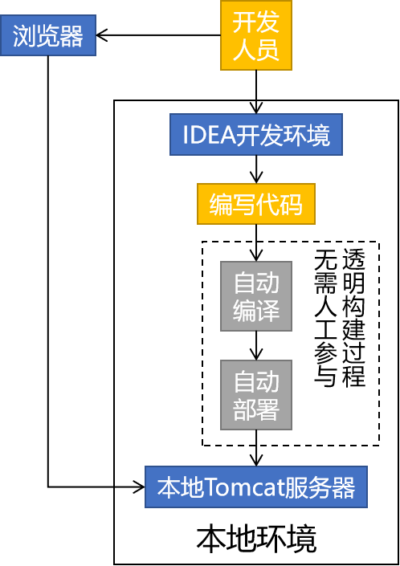

#  	Maven

## 第一章 Maven概述

### 第一节 为什么要学习Maven

#### 1. 从『构建』角度解释

##### 1.1 个人开发流程



##### 1.2 团队开发流程


##### 1.3 更大范围内的团队协作


### 2. 从『依赖』角度解释

#### 2.1 jar包的规模

随着我们使用越来越多的框架，或者框架封装程度越来越高，项目中使用的jar包也越来越多。项目中，一个模块里面用到上百个jar包是非常正常的。 


#### 2.2 jar包的来源

- 这个jar包所属技术的官网。官网通常是英文界面，网站的结构又不尽相同，甚至找到下载链接还发现需要通过特殊的工具下载。
- 第三方网站提供下载。问题是不规范，在使用过程中会出现各种问题。
  - jar包的名称
  - jar包的版本
  - jar包内的具体细节

#### 2.3 jar包之间的依赖关系

框架中使用的jar包，不仅数量庞大，而且彼此之间存在错综复杂的依赖关系。依赖关系的复杂程度，已经上升到了完全不能靠人力手动解决的程度。另外，jar包之间有可能产生冲突。进一步增加了我们在jar包使用过程中的难度。

到目前为止，我们熟悉的jar包之间依赖关系有下面这些例子：

- junit-4.12依赖hamcrest-core-1.3
- thymeleaf-3.0.12.RELEASE依赖ognl-3.1.26
  - ognl-3.1.26依赖javassist-3.20.0-GA
- thymeleaf-3.0.12.RELEASE依赖attoparser-2.0.5.RELEASE
- thymeleaf-3.0.12.RELEASE依赖unbescape-1.1.6.RELEASE
- thymeleaf-3.0.12.RELEASE依赖slf4j-api-1.7.26

而实际上jar包之间的依赖关系是普遍存在的，如果要由程序员手动梳理无疑会增加极高的学习成本，而这些工作又对实现业务功能毫无帮助。

### 第二节 什么是Maven

 Maven是Apache软件基金会组织维护的一款专门为Java项目提供**构建**和**依赖**管理支持的工具。 


### 1. 什么是构建

Java项目开发过程中，构建指的是使用**『原材料生产产品』**的过程。

- 原材料

  - Java源代码

  - 基于HTML的Thymeleaf文件

  - 图片

  - 配置文件

  - ###### ……等等

- 产品

  - 一个可以在服务器上运行的项目

构建过程包含的主要的环节：

- 清理：删除上一次构建的结果，为下一次构建做好准备
- 编译：Java源程序编译成*.class字节码文件
- 测试：运行提前准备好的测试程序(Junit)
- 报告：针对刚才测试的结果生成一个全面的信息
- 打包
  - Java工程：jar包
  - Web工程：war包
- 安装：把一个Maven工程安装到Maven仓库
- 部署：将准备好的jar包或war包部署到服务器上运行

### 2. 什么是依赖

如果A工程里面用到了B工程的类、接口、配置文件等等这样的资源，那么我们就可以说A依赖B。例如：

- junit-4.12依赖hamcrest-core-1.3
- thymeleaf-3.0.12.RELEASE依赖ognl-3.1.26
  - ognl-3.1.26依赖javassist-3.20.0-GA
- thymeleaf-3.0.12.RELEASE依赖attoparser-2.0.5.RELEASE
- thymeleaf-3.0.12.RELEASE依赖unbescape-1.1.6.RELEASE
- thymeleaf-3.0.12.RELEASE依赖slf4j-api-1.7.26

依赖管理中要解决的具体问题：

- jar包的下载：使用Maven之后，jar包会从规范的远程仓库下载到本地
- jar包之间的依赖：通过依赖的传递性自动完成
- jar包之间的冲突：通过对依赖的配置进行调整，让某些jar包不会被导入

## 第二章 Maven核心程序解压和配置

### 第一节 Maven核心程序解压与配置

#### 1. 解压Maven核心程序

 核心程序压缩包：apache-maven-3.5.4-bin.zip，解压到**非中文、没有空格**的目录 , 在解压目录中，我们需要着重关注Maven的核心配置文件：conf/settings.xml 

#### 2. 指定本地仓库

本地仓库默认值：用户家目录/.m2/repository。由于本地仓库的默认位置是在用户的家目录下，而家目录往往是在C盘，也就是系统盘。将来Maven仓库中jar包越来越多，仓库体积越来越大，可能会拖慢C盘运行速度，影响系统性能。所以建议将Maven的本地仓库放在其他盘符下。配置方式如下： 

```xml

<!-- localRepository
| The path to the local repository maven will use to store artifacts.
|
| Default: ${user.home}/.m2/repository
<localRepository>/path/to/local/repo</localRepository>
-->
<localRepository>D:\mavenRepository</localRepository>
```

本地仓库这个目录，我们手动创建一个空的目录即可。

**记住**：一定要把localRepository标签**从注释中拿出来**。

**注意**：本地仓库本身也需要使用一个**非中文、没有空格**的目录。

#### 3. 配置阿里云提供的镜像仓库

Maven下载jar包默认访问境外的中央仓库，速度很慢。改成阿里云提供的镜像仓库，访问国内网站，可以让Maven下载jar包的时候速度更快。配置的方式是：将下面mirror标签整体复制到mirrors标签的内部。 

```xml
<mirrors>
    <mirror>
        <id>nexus-aliyun</id>
        <mirrorOf>central</mirrorOf>
        <name>Nexus aliyun</name>
        <url>http://maven.aliyun.com/nexus/content/groups/public</url>
    </mirror>
</mirrors>
```

#### 4. 配置Maven工程的基础JDK版本

如果按照默认配置运行，Java工程使用的JDK版本是1.5。配置的方式是：将profile标签整个复制到profiles标签内。 

```xml
<profiles>
    <profile>
      <id>jdk-1.8</id>
      <activation>
        <activeByDefault>true</activeByDefault>
        <jdk>1.8</jdk>
      </activation>
      <properties>
        <maven.compiler.source>1.8</maven.compiler.source>
        <maven.compiler.target>1.8</maven.compiler.target>
        <maven.compiler.compilerVersion>1.8</maven.compiler.compilerVersion>
      </properties>
    </profile>
</profiles>
```

### 第二节 配置环境变量

#### 1. 检查JAVA_HOME配置是否正确

Maven是一个用Java语言开发的程序，它必须基于JDK来运行，需要通过JAVA_HOME来找到JDK的安装位置。 


 可以使用下面的命令验证： 

```
C:\Users\Administrator>echo %JAVA_HOME%
D:\software\Java
C:\Users\Administrator>java -version
java version "1.8.0_141"
Java(TM) SE Runtime Environment (build 1.8.0_141-b15)
Java HotSpot(TM) 64-Bit Server VM (build 25.141-b15, mixed mode)
```

#### 2. 配置MAVEN_HOME


配置环境变量的规律：

XXX_HOME指向的是bin目录的上一级

PATH指向的是bin目录

#### 3. 配置PATH


#### 4. 验证

```
C:\Users\Administrator>mvn -v
Apache Maven 3.5.4 (1edded0938998edf8bf061f1ceb3cfdeccf443fe; 2018-06-18T02:33:14+08:00)
Maven home: D:\software\apache-maven-3.5.4\bin\..
Java version: 1.8.0_141, vendor: Oracle Corporation, runtime: D:\software\Java\jre
Default locale: zh_CN, platform encoding: GBK
OS name: "windows 10", version: "10.0", arch: "amd64", family: "windows"
```

## 第三章 Maven的仓库和坐标

### 1. Maven的仓库

maven的仓库就是maven存放jar包的位置，主要分为如下三类仓库

| 仓库名称 | 作用                                                         |
| -------- | ------------------------------------------------------------ |
| 本地仓库 | 相当于缓存，工程第一次会从远程仓库（互联网）去下载jar 包，将jar包存在本地仓库（在程序员的电脑上）。第二次不需要从远程仓库去下载。先从本地仓库找，如果找不到才会去远程仓库找。 |
| 中央仓库 | 仓库中jar由专业团队（maven团队）统一维护。中央仓库的地址：https://repo1.maven.org/maven2/ |
| 远程仓库 | 在公司内部架设一台私服，其它公司架设一台仓库，对外公开。     |

### 2. Maven的坐标

Maven的一个核心的作用就是管理项目的依赖，引入我们所需的各种jar包等。为了能自动化的解析任何一个Java构件，Maven必须将这些Jar包或者其他资源进行唯一标识，这是管理项目的依赖的基础，也就是我们要说的坐标。包括我们自己开发的项目，也是要通过坐标进行唯一标识的，这样才能才其它项目中进行依赖引用。坐标的定义元素如下：

- groupId:项目组织唯一的标识符，实际对应JAVA的包的结构 (一般写公司的组织名称 eg:com.atguigu,com.alibaba,org.apache)  
- artifactId: 项目的名称
- version：定义项目的当前版本 

例如：要引入druid，只需要在pom.xml配置文件中配置引入druid的坐标即可：

```xml
<dependecies>
	<!--druid连接池-->
	<dependency>
  		<groupId>com.alibaba</groupId>
  		<artifactId>druid</artifactId>    
  		<version>1.0.9</version>
	</dependency>
    <dependency>
    	<groupId>mysql</groupId>
        <artifactId>mysql-connector-java</artifactId>
        <version>5.1.6</version>
		<scope>runtime</scope>
    </dependency>
    <dependency>
        <groupId>com.alibaba</groupId>
  		<artifactId>fastjson</artifactId>    
  		<version>1.1.39</version>
    </dependency>
</dependecies>
```

## 第四章 在IDEA中集成Maven

### 1. 配置maven软件的安装路径和本地仓库路径


### 2. 配置Maven的Runner参数(不用去做)

参数一: -DarchetypeCatalog=internal    解决使用骨架构建Maven项目时候会卡住的问题

参数二: -Dfile.encoding=GB2312   解决Maven工程中控制台输出中文乱码的问题


**注意事项:**

上述配置如果是在settings中进行配置则只会对当前Project生效，后续创建的新的Project不会生效


如果是在other setting里面的setting for new projects中配置，则会对后续创建的所有新的Project都生效，但是无法对当前项目生效


## 第五章 使用IDEA创建基于Maven的工程

使用IDEA创建基于Maven的工程有两种方式:

1. 使用Maven骨架创建(不建议使用，因为构建速度慢，而且容易卡死)
2. 不使用Maven骨架创建(建议使用)，我们以后创建Maven工程就选择这种方式创建

### 第一节 创建JavaSE工程

1. 第一步


2. 第二步


创建后的工程目录


引入单元测试的依赖

```xml
<dependency>
    <groupId>junit</groupId>
    <artifactId>junit</artifactId>
    <version>4.13</version>
    <!--指定当前依赖的使用范围，只能在test目录中使用-->
    <scope>test</scope>
</dependency>
```

### 第二节 创建JavaWeb工程

1. 在IDEA中安装一个插件(JBLJavaToWeb)
2. 按照创建javase工程的方式创建(此时创建出来的是javase工程)
3. 使用JBLJavaToWeb插件将javase工程转成javaweb工程


转换之后会在main目录中多出一个web目录，并且pom.xml文件中会自动添加打包方式为`<packaging>war<packaging/>`

因为我们需要在javaweb项目中使用Servlet，所以需要引入Servlet的依赖

```xml
<dependency>
    <groupId>javax.servlet</groupId>
    <artifactId>javax.servlet-api</artifactId>
    <version>3.1.0</version>
    <scope>provided</scope>
</dependency>
```


## 第六章 Maven构建命令

执行Maven构建命令有两种方式:

1. 如果是自己使用IDEA创建的Maven工程，可以自己直接在IDEA的Maven面板上执行相应的构建命令
2. 如果是该项目是从其它地方拷贝过来的，并且没有在IDEA上打开，则可以使用命令行来进行Maven构建

**注意事项:**

运行Maven中和构建操作相关的命令时，必须进入到pom.xml所在的目录。如果没有在pom.xml所在的目录运行Maven的构建命令，那么会看到下面的错误信息： 

```
The goal you specified requires a project to execute but there is no POM in this directory
```

### 1. 清理程序

mvn clean命令是清除项目的构建的内容，具体的效果是删除target目录

### 2. 编译程序

compile命令是对工程进行编译，具体效果是产生target目录，而编译又分为: 编译主程序和编译测试程序

#### 2.1 编译主程序

mvn compile 命令是编译主程序，主程序编译之后的文件会生成在 target/classes 目录中

#### 2.2 编译测试程序

mvn test-compile  命令是编译测试程序，测试程序编译之后的文件会生成在  target/test-classes 目录中

### 3. 执行测试

mvn test会执行测试程序中的所有测试用例，并且将生成的测试报告存放在target/surefire-reports目录下。

在执行mvn test命令的过程中，会自动先执行mvn compile、mvn test-compile，然后再执行mvn test进行测试

### 4. 程序打包

mvn package命令会对程序进行打包，如果是javase工程会打成jar包，而javaweb工程则会打成war包，打包得到的结果会生成在target目录中

在执行mvn package命令的过程中，会自动先执行mvn compile、mvn test-compile、mvn test，然后再执行mvn package进行打包

### 5. 安装操作

mvn install 命令会将程序打成的包安装到本地仓库(针对jar包，war包安装到本地仓库意义不大)

在执行mvn install命令的过程中，会自动先执行mvn clean、mvn compile、mvn test-compile、mvn test、mvn package，然后再执行mvn package进行打包

安装的效果是将本地构建过程中生成的jar包存入Maven本地仓库。这个jar包在Maven仓库中的路径是根据它的坐标生成的。

坐标信息如下：

```xml
<groupId>com.atguigu.maven</groupId>
<artifactId>pro01-maven-java</artifactId>
<version>1.0-SNAPSHOT</version>
```

 在Maven仓库中生成的路径如下： 

```
D:\mavenRepository\com\atguigu\maven\pro01-maven-java\1.0-SNAPSHOT\pro01-maven-java-1.0-SNAPSHOT.jar
```

另外，安装操作还会将pom.xml文件转换为XXX.pom文件一起存入本地仓库。所以我们在Maven的本地仓库中想看一个jar包原始的pom.xml文件时，查看对应XXX.pom文件即可，它们是名字发生了改变，本质上是同一个文件。 

## 第七章 Maven的依赖

### 第一节 引入依赖

在maven项目中，我们只需要通过jar包的maven坐标去引入jar包就可以了，而不需要像之前一样手动导入jar包。至于每一个jar包的坐标到底怎么写，我们不需要记忆，写代码的时候可以直接复制，如果需要查找则可以到`http://mvnrepository.com/`或者`https://developer.aliyun.com/mvn/search`网站查找即可

例如，引入单元测试的依赖:

```xml
<dependencies>
    <dependency>
        <groupId>junit</groupId>
        <artifactId>junit</artifactId>
        <version>4.12</version>
        <scope>test</scope>
    </dependency>
<dependencies>
```

当前项目的所有依赖都是放在`<dependencies>`标签里面，而具体每一个jar包的坐标则是放在一个`<dependency>`标签中

### 第二节 依赖范围

`<scope>`标签表示依赖的范围，它的位置是在` dependencies/dependency/scope `，该标签中的值可以是`compile`、`test`、`provided`、`runtime`这四个值中的一个，如果没有手动指定依赖范围，那么依赖范围默认是`compile`

#### 四种依赖范围的对比

| 依赖范围 | main目录（空间） | test目录（空间） | 编译阶段（时间） | 运行阶段（时间） |
| -------- | ---------------- | ---------------- | ---------------- | ---------------- |
| compile  | 有效             | 有效             | 有效             | 有效             |
| test     | 无效             | 有效             | 有效             | 无效             |
| provided | 有效             | 有效             | 有效             | 无效             |
| runtime  | 无效             | 无效             | 无效             | 有效             |

1. compile: 该范围的依赖既可以在main目录使用，又可以在test目录使用，即在编译阶段使用，又在实际运行阶段使用(会打到war/jar包中)，通常使用的第三方框架的jar包这样在项目实际运行时真正要用到的jar包都是以compile范围进行依赖的。比如SSM框架所需jar包。
2. test: 该范围的依赖只能在test目录中使用，不能在main目录中使用，只能在编译阶段使用，无法在项目运行阶段使用(不会打到war/jar包中)，引入junit单元测试依赖的时候会使用该范围
3. provided: 该范围的依赖即可在main目录使用，又可以在test目录使用，但是它只能在编译阶段使用，无法在项目运行阶段使用(不会打到war/jar包中)。比如说Tomcat服务器中内置有`servlet-api`、`jsp-api`等等依赖，所以我们在项目中引入这些依赖的时候的目标仅仅是**让我们的代码编译通过**， 为了避免和服务器上已有的同类jar包产生冲突，同时减轻服务器的负担我们**不会选择将这些依赖打到war包中**。说白了就是：“服务器上已经有了，你就别带啦！” 
4. runtime: 该范围的依赖既不可在main目录使用，又不可在test目录使用，说白了就是它无法在编译阶段使用，只能在项目运行阶段使用(会打到war/jar包中)。比如说MySQL驱动的依赖，我们在开发(写代码)的过程中根本不需要使用MySQL驱动中的任何类(因为都是直接用的JDBC接口)，只在运行阶段需要MySQL驱动的依赖，所以我们就可以将MySQL驱动的范围指定为`runtime`这样能有助于提升编译效率

### 第三节 依赖的传递性和依赖的排除
#### 1. 依赖的传递性
依赖的传递性指的是: A依赖B，B依赖C，那么在A没有配置对C的依赖的情况下，A里面能不能直接使用C。
在A依赖B，B依赖C的前提下，C是否能够传递到A，取决于B依赖C时使用的依赖范围。

- B依赖C时使用compile范围：可以传递
- B依赖C时使用test或provided范围：不能传递，所以需要这样的jar包时，就必须在需要的地方明确配置依赖才可以。

#### 2. 依赖的排除

##### 2.1 什么是依赖排除

当A依赖B，B依赖C而且C可以传递到A的时候，但是A不想要C，需要在A里面把C排除掉。而往往这种情况都是为了避免jar包之间的冲突。 


 所以配置依赖的排除其实就是阻止某些jar包的传递。因为这样的jar包传递过来会和其他jar包冲突。 

##### 2.2 怎么实现依赖排除

```xml
<dependency>
    <groupId>org.springframework</groupId>
    <artifactId>spring-beans</artifactId>
    <version>4.2.4.RELEASE</version>
    <!--直接排除-->
    <exclusions>
        <exclusion>
            <groupId>org.springframework</groupId>
            <artifactId>spring-core</artifactId>
        </exclusion>
    </exclusions>
</dependency>
```

## 第八章 继承和聚合

### 第一节 继承

#### 1. 概念

Maven工程之间，A工程继承B工程

- B工程：父工程
- A工程：子工程

本质上是A工程的pom.xml中的配置继承了B工程中pom.xml的配置。

#### 2. 作用

 在父工程中统一管理项目中的依赖信息，具体来说是管理依赖信息的版本，各个子工程使用依赖的时候版本就统一了

#### 3. 配置

在子工程的pom.xml文件中通过`<parent>`标签指定当前子工程的父工程

```xml
<parent>
    <artifactId>maven-parent</artifactId>
    <groupId>com.atguigu</groupId>
    <version>1.0-SNAPSHOT</version>
</parent>
```

#### 4.  继承的实际意义


编写一套符合要求、开发各种功能都能正常工作的依赖组合并不容易。如果公司里已经有人总结了成熟的组合方案，那么再开发新项目时，如果不使用原有的积累，而是重新摸索，会浪费大量的时间。为了提高效率，我们可以使用工程继承的机制，让成熟的依赖组合方案能够保留下来。

如上图所示，公司级的父工程中管理的就是成熟的依赖组合方案，各个新项目、子系统各取所需即可。

### 第二节 聚合

#### 1. 概念

使用一个“总工程”将各个“模块工程”汇集起来，作为一个整体对应完整的项目。

- 项目：整体
- 模块：部分

> 概念的对应关系：
>
> 从继承关系角度来看：
>
> - 父工程
> - 子工程

> 从聚合关系角度来看：
>
> - 总工程
> - 模块工程

#### 2. 作用

- 一键执行Maven命令：很多构建命令都可以在“总工程”中一键执行。

  以mvn install命令为例：Maven要求有父工程时先安装父工程；有依赖的工程时，先安装依赖的工程。我们自己考虑这些规则会很麻烦。但是工程聚合之后，在总工程执行mvn install可以一键完成安装，而且会自动按照正确的顺序执行。

- 配置聚合之后，各个模块工程会在总工程中展示一个列表，让项目中的各个模块一目了然。

#### 3. 配置

##### 3.1 在总工程的pom.xml中指定总工程的打包方式为pom

```xml
<groupId>com.atguigu</groupId>
<artifactId>maven-parent</artifactId>
<version>1.0-SNAPSHOT</version>
<packaging>pom</packaging>
```

##### 3.2 在总工程的pom.xml中指定总工程需要聚合的所有分工程

```xml
<modules>  
    <module>maven-child-01</module>
    <module>maven-child-02</module>
    <module>maven-child-03</module>
</modules>
```

##### 3.3 项目聚合需要注意循环依赖的问题

如果A工程依赖B工程，B工程依赖C工程，C工程又反过来依赖A工程，那么在执行构建操作时会报下面的错误：

> [ERROR] [ERROR] The projects in the reactor contain a cyclic reference:

这个错误的含义是：循环引用。


### 第三节 继承和聚合的具体操作

#### 1. 创建父工程

使用maven创建javase工程的方式创建父工程


因为父工程中只需要管理项目依赖的版本，不用编写java，所以可以删除父工程的src目录，只保留pom.xml文件


注意: 在父工程的pom.xml中需要指定打包方式为pom

```xml
<groupId>com.atguigu.maven</groupId>
<artifactId>maven-parent</artifactId>
<version>1.0-SNAPSHOT</version>
<packaging>pom</packaging>
```

#### 2. 在父工程中统一管理项目所需的所有依赖的版本

```xml
<!-- 使用dependencyManagement标签配置对依赖的管理 -->
<!-- 被管理的依赖并没有真正被引入到工程 -->
<dependencyManagement>
    <dependencies>
        <dependency>
            <groupId>org.springframework</groupId>
            <artifactId>spring-core</artifactId>
            <version>4.0.0.RELEASE</version>
        </dependency>
        <dependency>
            <groupId>org.springframework</groupId>
            <artifactId>spring-beans</artifactId>
            <version>4.0.0.RELEASE</version>
        </dependency>
        <dependency>
            <groupId>org.springframework</groupId>
            <artifactId>spring-context</artifactId>
            <version>4.0.0.RELEASE</version>
        </dependency>
        <dependency>
            <groupId>org.springframework</groupId>
            <artifactId>spring-expression</artifactId>
            <version>4.0.0.RELEASE</version>
        </dependency>
        <dependency>
            <groupId>org.springframework</groupId>
            <artifactId>spring-aop</artifactId>
            <version>4.0.0.RELEASE</version>
        </dependency>
    </dependencies>
</dependencyManagement>
```

#### 3. 创建多个子工程

因为需要将子工程创建在父工程下，所以注意要将子工程的路径指定在父工程路径下


所有子工程都创建好之后的项目结构:


观察子工程的pom.xml文件可以看到，pom.xml文件中自动生成了`<parent>`标签用于指定父工程

```xml
<parent>
    <artifactId>maven-parent</artifactId>
    <groupId>com.atguigu</groupId>
    <version>1.0-SNAPSHOT</version>
</parent>
```

观察父工程的pom.xml文件可以看到，pom.xml文件中自动生成了`<modules>`标签用于指定父工程聚合的所有子工程

```xml
<modules>
    <module>maven-child-01</module>
    <module>maven-child-02</module>
    <module>maven-child-03</module>
</modules>
```

#### 4. 在子工程中引入依赖

因为父工程中已经统一管理了所有依赖的版本，所以子工程引入依赖的时候就不需要写依赖的版本了

```xml
<!-- 子工程引用父工程中的依赖信息时，可以把版本号去掉。  -->
<!-- 把版本号去掉就表示子工程中这个依赖的版本由父工程决定。 -->
<!-- 具体来说是由父工程的dependencyManagement来决定。 -->
<dependencies>
    <dependency>
        <groupId>org.springframework</groupId>
        <artifactId>spring-core</artifactId>
    </dependency>
    <dependency>
        <groupId>org.springframework</groupId>
        <artifactId>spring-beans</artifactId>
    </dependency>
    <dependency>
        <groupId>org.springframework</groupId>
        <artifactId>spring-context</artifactId>
    </dependency>
    <dependency>
        <groupId>org.springframework</groupId>
        <artifactId>spring-expression</artifactId>
    </dependency>
    <dependency>
        <groupId>org.springframework</groupId>
        <artifactId>spring-aop</artifactId>
    </dependency>
</dependencies>
```

虽然在子工程中引入依赖的时候没有写依赖的版本，但我们可以看到子工程中实际引入的依赖的版本和父工程中统一管理的版本是一致的


#### 5. 在父工程中自定义属性进行版本锁定

##### 5.1 什么是自定义属性

在pom.xml文件中的`<properties>`标签中添加子标签进行自定义属性，子标签的标签名就是属性名，子标签的标签体的内容就是属性值，例如:

```xml
<properties>
    <atguigu.username>tom</atguigu.username>
</properties>
```

那么我们在pom.xml中就可以使用`${属性名}`来获取属性值

##### 5.2 什么是版本锁定

因为父工程在管理项目依赖的时候，需要管理非常多的依赖，而有很多依赖的版本都应该是相同的，比如spring框架的相关依赖都需要统一版本

```xml
<dependencyManagement>
    <dependencies>
        <dependency>
            <groupId>org.springframework</groupId>
            <artifactId>spring-core</artifactId>
            <version>4.0.0.RELEASE</version>
        </dependency>
        <dependency>
            <groupId>org.springframework</groupId>
            <artifactId>spring-beans</artifactId>
            <version>4.0.0.RELEASE</version>
        </dependency>
        <dependency>
            <groupId>org.springframework</groupId>
            <artifactId>spring-context</artifactId>
            <version>4.0.0.RELEASE</version>
        </dependency>
        <dependency>
            <groupId>org.springframework</groupId>
            <artifactId>spring-expression</artifactId>
            <version>4.0.0.RELEASE</version>
        </dependency>
        <dependency>
            <groupId>org.springframework</groupId>
            <artifactId>spring-aop</artifactId>
            <version>4.0.0.RELEASE</version>
        </dependency>
    </dependencies>
</dependencyManagement>
```

如果未进行版本锁定的话，我们修改spring框架的版本的时候，就需要手动将每一个依赖的版本都进行修改，这无疑是非常麻烦而且容易出错的操作

所谓版本锁定就是自定义一个属性，属性值就是要统一的版本，然后在`<version>`标签体中引入该属性值就行了

```xml
<properties>
    <atguigu.spring.version>4.0.0.RELEASE</atguigu.username>
</properties>
<dependencyManagement>
    <dependencies>
        <dependency>
            <groupId>org.springframework</groupId>
            <artifactId>spring-core</artifactId>
            <version>${atguigu.spring.version}</version>
        </dependency>
        <dependency>
            <groupId>org.springframework</groupId>
            <artifactId>spring-beans</artifactId>
            <version>${atguigu.spring.version}</version>
        </dependency>
        <dependency>
            <groupId>org.springframework</groupId>
            <artifactId>spring-context</artifactId>
            <version>${atguigu.spring.version}</version>
        </dependency>
        <dependency>
            <groupId>org.springframework</groupId>
            <artifactId>spring-expression</artifactId>
            <version>${atguigu.spring.version}</version>
        </dependency>
        <dependency>
            <groupId>org.springframework</groupId>
            <artifactId>spring-aop</artifactId>
            <version>${atguigu.spring.version}</version>
        </dependency>
    </dependencies>
</dependencyManagement>
```

进行版本锁定之后，如果有修改依赖版本的需求，则只需要取修改自定义属性的值就可以了

## 第九章  jar包下载失败问题的解决方案

### 第一节 为什么会发生jar包下载失败

 Maven替我们去下载jar包的时候，有可能出现在网络传输过程中数据丢失、中途断网，从而导致下载失败。 


### 第二节 Maven正常下载的做法

- jar包在下载过程中，jar包的扩展名是xxx.jar.lastUpdated
- jar包下载成功后，Maven会将lastUpdated扩展名删除，让jar包恢复为xxx.jar这样的名称

### 第三节 下载失败的第一种情况

#### 1. Maven的行为描述

- jar包在下载过程中，jar包的扩展名是xxx.jar.lastUpdated
- 网络连接丢失，无法继续下载
- jar包没有下载完，lastUpdated扩展名不会被删除
- 当我们要求Maven重新下载时，Maven看到这个jar包的扩展名是lastUpdated，Maven就不会重新下载了

#### 2. 解决办法

手动删除所有以lastUpdated结尾的文件，然后让Maven重新下载。可是当仓库中lastUpdated文件太多的时候，手动删除不可行，所以我们需要借助批处理文件：clearLastUpdated.bat。使用方法：

- 将clearLastUpdated.bat文件复制到本地仓库的根目录
- 使用文件编辑打开clearLastUpdated.bat文件
- 修改下面的内容

> SET CLEAR_PATH=设置为本地仓库所在的盘符 SET CLEAR_DIR=设置为本地仓库的根目录的路径

例如：

> SET CLEAR_PATH=D:  SET CLEAR_DIR=D:\maven-rep1026

- 在想要执行清理时，双击运行这个文件即可

#### 3. 要求Maven重新下载jar包


### 第四节 下载失败的第二种情况

#### 1. 文件校验工具

jar包表面上看起来是下载完的状态，结尾并没有“.lastUpdated”扩展名。但是程序运行时找不到这个jar包中的类。例如：针对jar包中的类出现ClassNotFoundException。

遇到类似问题需要先确认一下“有嫌疑”的jar包是否存在内部损坏问题。此时可以使用上面的文件校验工具。 


#### 2. 用法

- 打开文件校验工具
- 将待校验的jar包拖拽到文件校验工具窗口内
- 将待校验的jar包旁边的*.sha1文件打开
- 比较两个SHA1值
- 一致：jar包完好
- 不一致：jar包损坏

 

#### 3. 原理

HASH加密包括很多具体加密算法，但是所有HASH算法都满足下面特征：

- 只要输入数据不变，任何时候执行加密，输出不变
- 输入数据有细微变化，输出数据跟着变化
- 不可逆，不能通过密文反推回明文
- 每一种具体的HASH加密算法加密后长度固定

 

#### 4. 怎么快速找到有嫌疑的jar包

假设现在出现了一个ClassNotFoundException，提示找不到类：org.springframework.expression.Expression。此时我们怀疑这个类所在的jar包下载失败。

- 窍门1：类所在的package命名往往和jar包坐标的groupId部分类似。
- 窍门2：在IDEA中按两下Shift键，使用全类名搜索


#### 5. 删除有问题的jar包所在的目录，然后重新下载


